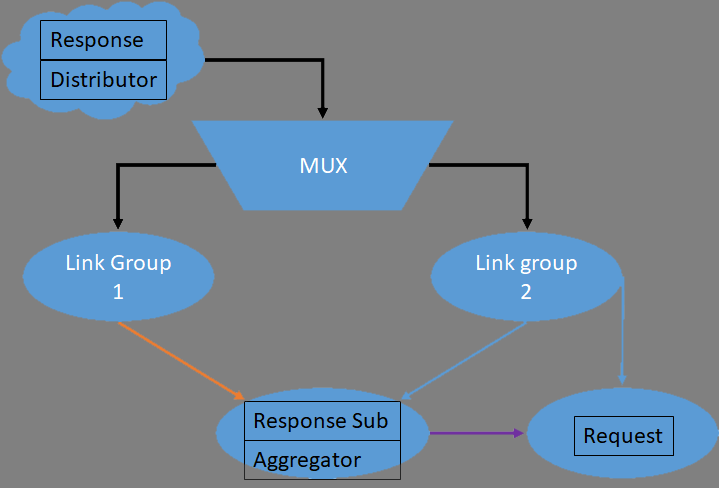

## Demo

Simple link switch or aggregation simulator. And a cache node controller based on content-request service (P/S struct).

## Backend Structure

**Cache** registers at **Dispatcher**.

|        SERVER SIDE        |     FILES      |        CACHE SIDE         |     FILES     |
| :-----------------------: | :------------: | :-----------------------: | :-----------: |
| **Content Publish Layer** |  Publisher.py  | **Content Publish Layer** |   Proxy.py    |
|   **Convergence Layer**   | Dispatcher.py  |   **Convergence Layer**   |  Terminal.py  |
|    **Data Flow Layer**    | Distributor.py |    **Data Flow Layer**    | Aggregator.py |
|                           |                |                           |               |

## Frontend Structure

**Client** registers at **Publisher**.

|       SCHEMA       |         REQUEST         |                 RESPONSE                 |        TRAITS         |
| :----------------: | :---------------------: | :--------------------------------------: | :-------------------: |
|   `Dual-Request`   | `at most twice/content` | `lack of popular statistical  feedback; dual control` |   `lower overhead`    |
|   Request-Proxy    |      once/content       | lack of cache uplink control; statistical feedback proxy | lower overhead if hit |
| **Request-Redist** |      once/content       |        overhead if request redist        |        Normal         |
|                    |                         |                                          |                       |

## Remained Problem

* Client上行 和 Cache上行，都依赖Wi-Fi链路
* Cache节点的proxy需要接受上层的下行控制
* Client是否需要两条上行链路？不需要。

## TODO

* **Distributor** window control for failure safe re-transmission
* modify and build the **content service** and **cache node** structure
* determine the client request schema